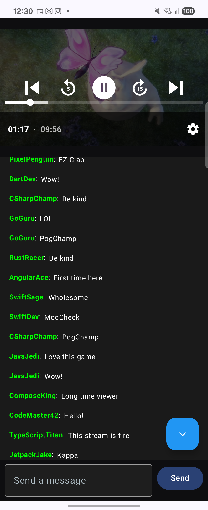

# Twitch-like Android App

A sample Android application that mimics Twitch's main viewing screen with a video player and live chat feed.

## Screenshots



## Features

### Video Player
- **ExoPlayer Integration**: Uses ExoPlayer to stream sample videos from public sources
- **Playlist Support**: All sample videos are queued so built-in next/previous controls work
- **Auto-loop**: Videos automatically repeat for continuous playback
- **16:9 Aspect Ratio**: Maintains proper video aspect ratio

### Live Chat Feed
- **High-Frequency Message Simulation**: Generates a busy stream of messages
- **Auto-Scroll**: Auto-scrolls only when the user is at/near the bottom; stops auto-scrolling when the user scrolls up
- **Scroll-To-Bottom FAB**: When scrolled up, a floating button appears to jump back to the latest message
- **Input Bar**: Single-line input with a Send button; sent messages are appended immediately to the stream
- **Message Highlighting**: Messages from `You` are visually highlighted (orange username and subtle bubble)
- **Batch Processing**: Emits updates to UI in batches for smooth performance
- **Retention Policy**: Keeps up to 5,000 most recent messages and automatically removes messages older than 10 minutes -- that code is commented tho

### Performance Optimizations
- **MVVM Architecture**: Clean separation of concerns with ViewModel and Repository
- **StateFlow**: Reactive UI updates using Kotlin Flow
- **LazyColumn**: Efficient list rendering for chat messages
- **Message Keying**: Proper item keys for optimal list performance
- **Synchronized Buffering**: Thread-safe message buffer management

### UI Controls
- **Scroll-To-Bottom Button**: Appears when the list is not at the bottom

## Architecture

### MVVM Pattern
```
UI Layer (Compose) → ViewModel → Repository → Data Layer
```

### Components
- **ChatRepository**: Simulates incoming chat events, manages retention (count + TTL), and supports sending user messages
- **ChatViewModel**: Manages UI state, input text, send action, and exposes stats
- **VideoPlayer**: ExoPlayer wrapper for video playback (playlist)
- **ChatList**: LazyColumn-based chat message display with smart auto-scroll
- **ChatInputBar**: Text input + Send button at the bottom of the chat
- **ControlPanel**: User controls and counters (pause/resume, memory info)

## Message Flow and Rates

- **Generation rate**: By default, a new message is generated every 100 ms (~10 msg/sec). Adjust in `ChatRepository.startGenerating(...)` by changing `delay(100)`.
- **UI batch cadence**: Repository emits batches approximately every 66 ms (~15 fps) to keep UI smooth.
- **Send path**: User messages go straight to the UI stream for immediate visibility via `ChatRepository.sendUserMessage(...)`.
- **Auto-scroll policy**: The UI auto-scrolls only when the user is at/near the bottom. Scrolling up disables auto-scroll; tapping the FAB re-enables it and jumps to the latest message.

## Overflow and Retention

- **Count-based retention**: The UI stream keeps only the last 5,000 messages: see `ChatRepository` where `_messagesFlow.update { (old + batch).takeLast(maxMessagesInMemory) }`.
- **TTL cleanup**: Messages older than 10 minutes are periodically removed (`cleanupOldMessages()`), independent of count.
- **Generator trimming (optional)**: Trimming in the generator loop can be enabled to keep the in-memory buffer bounded as well (currently commented in the repo for experimentation).

## Technical Details

### Dependencies
- **ExoPlayer**: Video playback (media3-exoplayer, media3-ui, media3-datasource)
- **Jetpack Compose**: Modern UI toolkit
- **ViewModel**: Lifecycle-aware UI state management
- **Kotlin Flow**: Reactive programming for state management
- **Coroutines**: Asynchronous programming
- **Koin**: Dependency injection for `ChatRepository` and `ChatViewModel`

### Performance Metrics
- **UI Updates**: Batched periodically for smoothness
- **Retention Capacity**: 5,000 messages
- **Message TTL**: 10 minutes (older messages are cleaned up periodically)

### Sample Data
- **Usernames**: Gaming and development-themed usernames
- **Messages**: Twitch-style chat phrases and emotes
- **Sample Videos**: Public domain videos from Google's sample collection

## Performance Goals

✅ Smooth UI updates under high-frequency message load

✅ Smart auto-scroll that respects user scroll position

✅ Retention policy with both count (5,000) and TTL (10 min)

✅ MVVM architecture with clean separation

✅ Jetpack Compose with LazyColumn for efficient rendering

✅ ExoPlayer integration with playlist support

✅ Pause chat toggle and skipped messages counter

The app demonstrates how to handle high-frequency data streams in Android while maintaining smooth UI performance through intelligent buffering, retention policies, and user-friendly scrolling behavior.
